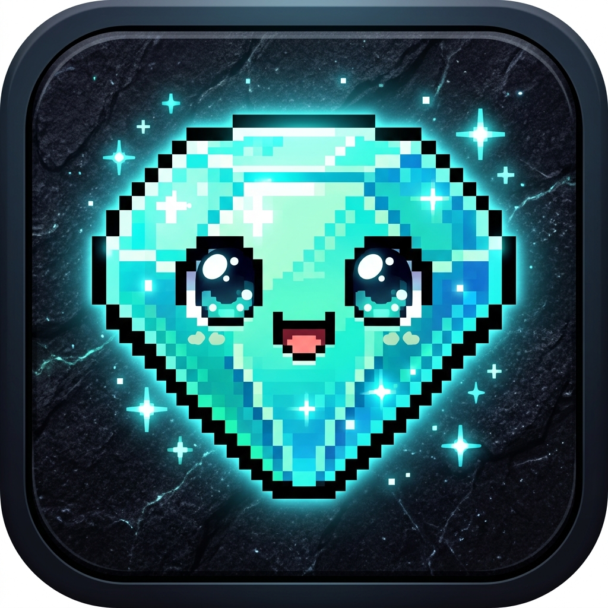

  

# 💎 Steve's Diamond Catch

> Vibe Coded game inspired by Minecraft characters

A retro arcade game featuring customizable speeds, session timer with cryptographic parental lock, synthesized 8-bit chiptune music, authentic sound effects, and full touch drag and button controls for mobile phones.

---

## 🎮 Features
- **🌟 Progressive Level System**:
  - **Level 1 (Peaceful Meadow)**: Pure diamond and golden apple collecting with **0% hostile mobs** — ideal for young children learning the game!
  - **Level 2 (Creeper Alert)**: Introduces Creepers that explode on contact (-1 heart, red flash, screen shake, haptic vibration).
  - **Level 3 (The Dark Forest)**: Introduces tall **Endermen** with glowing purple eyes that can teleport horizontally mid-fall with warp sound effects!
  - **Level 4 (Skeleton Barrage)**: Introduces fast-falling **Skeleton Arrows** dropping at 1.55x speed to test reflexes.
  - **Level 5+ (Ender Dragon Realm)**: Cosmic starry void storm with high-speed mob spawns and **2x Diamond Points**!
  - Animated on-screen "LEVEL UP!" celebratory banners and triumphant 8-bit fanfares.
  - Option to set **Starting Level** (Level 1–5) in settings.
- **⚙️ Speed & Difficulty Configuration**: Built-in settings modal with presets (*Slow*, *Normal*, *Fast*, *Insane*), custom falling item speed slider, and Steve movement speed slider.
- **🔒 Parental Screen Time Lock**:
  - Automatically locks the game when the session timer (default: 15 min) expires.
  - Salted SHA-256 cryptographic PIN verification (default PIN: `1234`).
  - Brute-force rate limiting with cooldown lockout penalties.
  - Persistent anti-tamper lock across browser refreshes and tab restarts.
- **🎵 8-Bit Chiptune Audio Engine**:
  - Synthesized via Web Audio API (zero external audio files, zero load times).
  - Looping background music and retro sound effects for catches, explosions, and game over.
- **📳 Mobile Touch & Haptics**:
  - Direct canvas horizontal touch/drag.
  - Virtual on-screen retro buttons (◀ LEFT / RIGHT ▶).
  - Phone vibration (`navigator.vibrate`) and screen shake impact effects.
- **📲 Progressive Web App (PWA)**:
  - Install to iPhone/Android Home Screen without browser address bars.
  - Service worker caching for 100% offline gameplay.

---

## 🚀 Running the Game

### On Windows
- **Play locally**: Double-click `Play_Game_Windows.bat` (or open `index.html` in any browser).
- **Broadcast to smartphone on local Wi-Fi**: Double-click `start_server.bat`.

### On macOS / Linux
- **Broadcast to smartphone on local Wi-Fi**: Run `./start_server.sh`.

### Online Deployment
- Easily deployable to **GitHub Pages**, **Vercel**, or **Netlify** for free worldwide HTTPS hosting (see `DEPLOYMENT.md`).
